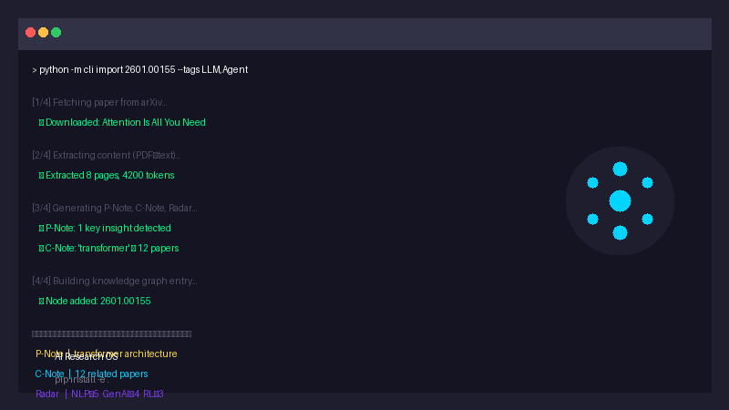

# AI Research OS

<div align="center">
  
</div>

**A Self-Evolving Research Operating System for AI Researchers**

[](https://python.org)
[](https://pypi.org/project/ai-research-os/)
[](https://app.codecov.io/gh/shushuzn/ai_research_os)
[](https://github.com/shushuzn/ai_research_os/actions)
[](#license)

<div align="center">
<a href="https://www.star-history.com/#shushuzn/ai_research_os&Date">
 <picture>
   <source media="(prefers-color-scheme: dark)" srcset="https://api.star-history.com/svg?repos=shushuzn/ai_research_os&type=Date&theme=dark" />
   <source media="(prefers-color-scheme: light)" srcset="https://api.star-history.com/svg?repos=shushuzn/ai_research_os&type=Date" />
   
 </picture>
</a>
</div>

## What It Does

AI Research OS is a **self-evolving research system** that learns from your usage patterns. It's not just a paper manager — it's a research partner that grows smarter over time.

Feed it a paper (arXiv URL, DOI, or PDF). Get back a **P-Note**, **C-Note**, **Radar entry**, and **Timeline entry** — all structured, tagged, and cross-linked.

| Input | Output |
|---|---|
| arXiv URL/ID | P-Note + C-Note + Radar + Timeline |
| DOI | P-Note + C-Note + Radar + Timeline |
| Local PDF | P-Note + C-Note + Radar + Timeline |
| Scanned PDF | Same (via OCR) |

This is **not a PDF manager**. It is a **Self-Evolving System** that:
- Learns from your research patterns
- Improves answers over time
- Adapts to your specific domain

## Core Features

| Feature | Description |
|---------|-------------|
| `airos import` | Import papers from arXiv, DOI, PDF |
| `airos chat` | RAG-powered Q&A with your papers |
| `airos slides` | Auto-generate presentations |
| `airos kg` | Knowledge graph visualization |
| Evolution | Self-improvement via Gene/Capsule patterns |

## Quick Start

```bash
pip install ai-research-os
airos-cli 2601.00155 --tags LLM,Agent
```

That's it — one paper imported in seconds. The above installs the package and imports an arXiv paper.

### One line, three inputs

```bash
airos-cli 2601.00155                          # arXiv ID
airos-cli 10.48550/arXiv.2601.00155           # DOI
airos-cli --pdf paper.pdf --tags RAG            # Local PDF
airos-cli --pdf scanned.pdf --ocr --ocr-lang chi_sim+eng   # Scanned PDF
```

### Three core commands

```bash
airos-cli import 2601.00155 10.1038/nature12373   # Add papers to DB
airos-cli search "attention mechanism" --tag LLM    # Search papers
airos-cli research "RLHF alignment" --limit 5       # Autonomous research loop
```

### AI draft (optional)

```bash
export OPENAI_API_KEY="***"
export OPENAI_BASE_URL="https://dashscope.aliyuncs.com/compatible-mode/v1"
airos-cli 2601.00155 --tags LLM --ai
```

For full configuration, see [API_CONFIG.md](API_CONFIG.md).

## Research Tree

Papers are organized into 12 directories:

```
00-Radar/            Topic heat tracking
01-Foundations/      Foundational papers
02-Models/           Model papers
03-Training/         Training methods
04-Scaling/         Scaling laws
05-Alignment/        Alignment research
06-Agents/           Agent systems
07-Infrastructure/    Infrastructure
08-Optimization/     Optimization techniques
09-Evaluation/       Evaluation methods
10-Applications/     Applied research
11-Future-Directions/
```

## Installation

```bash
pip install ai-research-os
```

Or install from source:

```bash
git clone https://github.com/shushuzn/ai_research_os.git
cd ai_research_os
pip install -e .
```

## Documentation

Full documentation at [ai-research-os.readthedocs.io](https://ai-research-os.readthedocs.io/).

| Doc | Description |
|-----|-------------|
| [Architecture](docs/architecture.md) | System design and module overview |
| [Configuration](docs/configuration.md) | LLM, DB, Search, Tool configuration |
| [Benchmarks](docs/benchmarks.md) | Performance metrics and test coverage |
| [Contributing](CONTRIBUTING.md) | How to contribute to this project |
| [Roadmap](ROADMAP.md) | Project roadmap and future plans |

## License

GPL-3.0-or-later. See [LICENSE](LICENSE) for details.
