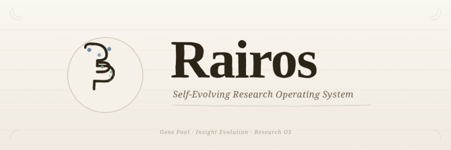

# AI 研究操作系统 (Rairos)

<div align="center">
  
</div>

**一个自进化的研究操作系统 — 从你的反馈中学习，自动发现更好的研究方向。** — 100% Rust (154 crates)

[](https://github.com/shushuzn/Rairos/actions)
[](#license)

## 它能做什么

Rairos 是一个**自主研究助手**，可以：

- **阅读论文** — arXiv、DOI、本地 PDF、扫描版（OCR）
- **发现空白** — 在 36 个 AI 主题中识别研究机会
- **学习你的偏好** — Gene Pool 编码你感兴趣的模式
- **自动进化** — 后台 daemon 监控 arXiv、分析文献、进化知识库
- **本地运行** — 支持 Ollama，零 API 费用，完全私密

```
输入一篇论文 → 系统学习什么有效 → 下一次搜索更精准
```

## 快速开始

### 选项 1: Cargo 构建

```bash
git clone https://github.com/shushuzn/Rairos.git
cd Rairos
CARGO_BUILD_JOBS=1 cargo build --workspace
cargo run -p rairos-cli -- --help
```

### 选项 2: 从源码（推荐开发用）

```bash
git clone https://github.com/shushuzn/Rairos.git
cd Rairos
CARGO_BUILD_JOBS=1 cargo build --workspace
cargo run -p rairos-cli -- init        # 初始化数据库
cargo run -p rairos-cli -- list        # 查看论文
```

### 初始化数据库

```bash
cargo run -p rairos-cli -- init
```

## Rust 技术栈 (154 crates)

| Crate | 用途 |
|-------|------|
| rairos-core | 核心数据库、FTS5、订阅管理 |
| rairos-cli | CLI 入口 (104 命令) |
| rairos-mcp | MCP 协议服务器 (68 工具) |
| rairos-llm | LLM 客户端、Gene Pool、进化引擎 |
| rairos-parser | arXiv/CrossRef/Semantic Scholar API |
| rairos-research | 深度研究 Agent、空白检测 |
| rairos-web | REST API + HTML 前端 |
| rairos-kg | 知识图谱、PageRank、社区发现 |

完整列表见 [AGENTS.md](AGENTS.md)。

## 架构

```
CLI (rairos-cli) → crates/* 全 Rust
```

所有数据存储在 `~/.ai_research_os/`，完全离线运行。

## 文档

- [全命令列表](AGENTS.md)
- [架构文档](docs/architecture.md)
- [安装指南](docs/installation.md)

## 许可证

GPL-3.0-or-later
