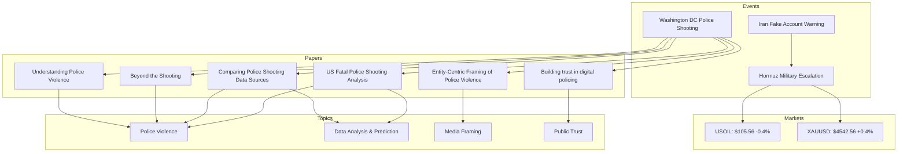

```mermaid
graph TD
  subgraph Events
    E1[Washington DC Police Shooting]
    E2[Iran Fake Account Warning]
    E3[Hormuz Military Escalation]
  end

  subgraph Papers
    P2106[US Fatal Police Shooting Analysis]
    P2006[Building trust in digital policing]
    P2109[Entity-Centric Framing of Police Violence]
    P401[Comparing Police Shooting Data Sources]
    P502[Beyond the Shooting]
    P603[Understanding Police Violence]
  end

  subgraph Topics
    T1[Police Violence]
    T2[Data Analysis & Prediction]
    T3[Media Framing]
    T4[Public Trust]
  end

  subgraph Markets
    M1[USOIL: $105.56 -0.4%]
    M2[XAUUSD: $4542.56 +0.4%]
  end

  E1 --> P2106
  E1 --> P2006
  E1 --> P2109
  E1 --> P401
  E1 --> P502
  E1 --> P603

  P2106 --> T1
  P2106 --> T2
  P2006 --> T4
  P2109 --> T3
  P401 --> T1
  P401 --> T2
  P502 --> T1
  P603 --> T1

  E2 --> E3
  E3 --> M1
  E3 --> M2
```
